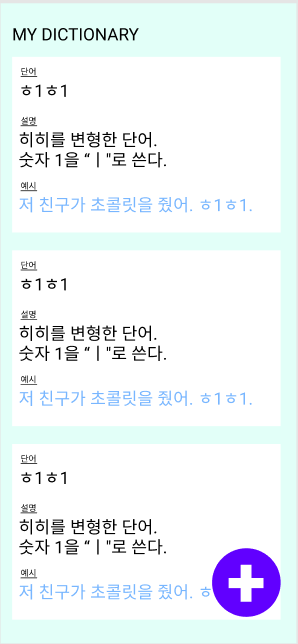
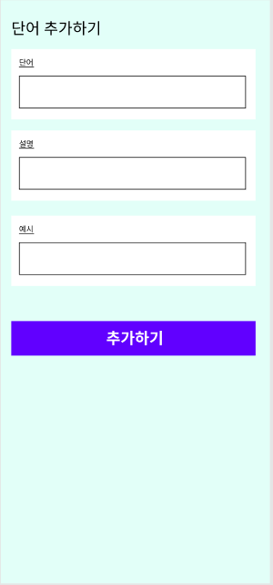

# 📕나만의 단어장
항해99 리액트 심화반 1주차 미션
- 기간 : 220603 ~
------
## ⚡Skills
- React
- Typescript
- Redux
- Jest
- Styled-Component
- Presentational and Container Component Pattern
------
## ⏳  Progress
- 프로젝트 셋팅 ◼◼◼◼◻
- 기본 레이아웃 구성 ◼◻◻◻◻
- 테스트 케이스 작성 ◻◻◻◻◻
- Mock-Api ◻◻◻◻◻
------

## 💡Mission
- 게시글 목록을 화면에 그리기 (각각 뷰는 카드 뷰로 만들기)
- 게시글 내의 예시는 파란 글씨로 보여주기
- 게시글 목록을 리덕스에서 관리하기
- 게시글 목록을 Mock api를 만들어 가져오기
- 게시글 작성에 필요한 input 3개를 ref로 관리하기
- 작성한 게시글을 리덕스 내 게시글 목록에 추가하기
- 무한 스크롤 붙이기
- 게시글 수정해보기

## ✨WireFrame

-----

swr